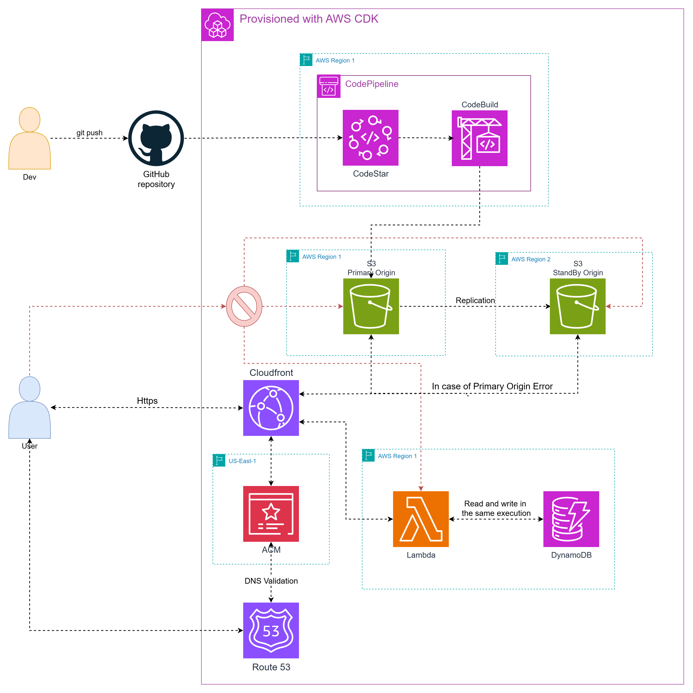

# 🌐 Geo-Resilient Serverless Stack

Secure, serverless web stack with global resilience, with a **static** frontend and an **intelligent visitor serverless API** that counts visitors, their country, and devices. The web deployment is fully automated through CI/CD on GitHub with AWS CodePipeline.


## 🏗️ Architectural Overview



### 1. Global Content Delivery & DNS
* **Edge Distribution:** Powered by **Amazon CloudFront** for global low-latency delivery.
* **Dynamic DNS & SSL:** The system performs an automated lookup of your **Route53 Hosted Zone**. If a matching domain or subdomain is configured, it automatically provisions an **ACM Certificate** and creates **A/AAAA Alias records** for seamless routing.
* **High Availability (Origin Group):** Implements a CloudFront **Origin Group** for the root path (`/`). It utilizes a **Primary S3 bucket** and a **Standby Replica bucket** (Secondary), with an active **Cross-Region Replication (CRR)** rule ensuring data parity across regions.
* **Strict Access Control:** S3 buckets are private and restricted via **Origin Access Control (OAC)**; they are accessible only through the CloudFront distribution.

### 2. Intelligent & Secure Visitor API (`/api/visitors`)
The backend is a cost-optimized **AWS Lambda** function acting as a unified GET/POST endpoint to minimize request overhead.
* **Security (Origin-Verify):** The Lambda is shielded; it only processes requests containing a specific **Shared Secret** in the `X-Origin-Verify` header, injected exclusively by the CloudFront distribution.
* **Smart Deduplication:** To prevent redundant counting from page refreshes, the system generates a **SHA-256 hash** of the visitor's `IP Address` and `User-Agent`.
* **DDB with TTL:** This hash is stored in **DynamoDB** with a **30-minute Time-To-Live (TTL)**. The Lambda checks for this hash before incrementing counts, ensuring "unique" visits within a 30-minute window.
* **High-Efficiency Queries:** Instead of expensive full-table scans, the architecture uses **Global Secondary Indexes (GSI)** to aggregate totals for countries and devices instantly.
* **Metadata Tracking:** Leverages CloudFront headers including `CloudFront-Viewer-Country`, `CloudFront-Is-Mobile-Viewer`, `CloudFront-Is-Tablet-Viewer`, and `User-Agent`.

### 3. Automated CI/CD Lifecycle
The deployment process is fully automated using **AWS CodePipeline** and **CodeBuild**.
* **GitHub Integration:** Connects via **AWS CodeStar** to monitor repository changes.
* **Continuous Deployment:** Every `git push` triggers a CodeBuild execution that:
    1.  Compiles the Next.js static export (generating the `/out` directory).
    2.  Synchronizes the build to the Primary S3 bucket.
    3.  Triggers a **CloudFront Invalidation** to refresh global edge caches instantly.


## 🛠️ Setup & Installation

### 0. Prerequisites: GitHub Connection
Before configuring the environment, you must manually establish a connection between AWS and your GitHub account. This is a one-time setup required for the CI/CD pipeline.

1.  **Navigate to Connections:** Open the AWS Console and go to **CodePipeline** > **Settings** > **Connections**.
2.  **Create Connection:**
    * Click **Create connection**.
    * Select **GitHub** as the provider.
    * Provide a name (e.g., `aws-github-connection`).
3.  **Authorize GitHub:**
    * Click **Connect to GitHub**. A popup will appear.
    * Select your GitHub organization/account.
    * If prompted, click **Install a new app** to grant AWS access to your repository.
4.  **Finalize Activation:**
    * Once authorized, ensure the status shows as **Available**. 
    * *Note: If it stays "Pending," click "Connect" again to finish the handshake.*
5.  **Copy the ARN:** Copy the generated ARN. It will look like this:
    `arn:aws:codestar-connections:region:account-id:connection/uuid`

> [!TIP]
> Keep this ARN handy; you will need to paste it into the `GITHUB_CONNECTION_ARN` field in your `.env` file in the next step.

### 1. Environment Configuration
You must create a `.env` file in the root directory. Copy and paste the following structure:

```env
# --- DEVELOPMENT ---
DEV_ACCOUNT=            # Your AWS account ID
DEV_REGION=             # Primary region (Bucket, Lambda, Dynamo, Pipeline)
DEV_FAILOVER_REGION=    # Standby replica bucket region
DEV_DOMAIN_NAME=        # Optional: DNS name (e.g., dev.yourdomain.com)

# --- PRODUCTION ---
PROD_ACCOUNT=           # Your AWS account ID
PROD_REGION=            # Primary region
PROD_FAILOVER_REGION=   # Standby replica bucket region
PROD_DOMAIN_NAME=       # Optional: DNS name (e.g., yourdomain.com)

# --- GLOBAL SECRETS ---
SHARED_SECRET=          # Unique token for CloudFront-to-Lambda authentication

# --- GITHUB CI/CD ---
GITHUB_USERNAME=        # Your GitHub username
GITHUB_REPOSITORY=      # The repository name
GITHUB_CONNECTION_ARN=  # The CodeStar Connection ARN
````

### 2. Local Development Environment
To ensure a consistent development environment, this project uses an automated bootstrapping script.

* **Run the initialization script:**

```bash
source ./init.sh
```
* **Process:** The `init.sh` script checks for a Python virtual environment (`venv`). If one is not found, it creates it and installs all necessary dependencies from `requirements.txt`.

### 3. Deployment

Once the environment is initialized and your `.env` is configured, you can deploy the stack to your desired environment:

* **Development (Default):**
    ```bash
    cdk deploy --all
    ```
* **Production:**
    ```bash
    cdk deploy --all --env=prod
    ```

> [!IMPORTANT]
> **Production Resource Persistence**
> For security and data integrity, all S3 buckets and DynamoDB tables in the **production environment** are configured with a `RETAIN` removal policy.
> * Data and resources will **not be deleted** if the CDK stack is destroyed.
> * **Manual cleanup** via the AWS Console or CLI is required if you wish to permanently remove these resources.

---

## 📊 Technical Specifications

| Component | Technology | Optimization / Security Pattern |
| :--- | :--- | :--- |
| **Frontend** | Next.js (Static Export) | S3 Origin Group Failover |
| **API** | AWS Lambda | Combined GET/POST for cost efficiency |
| **Database** | DynamoDB | TTL-based deduplication & GSI for aggregation |
| **Infrastructure** | AWS CDK (Python) | 100% Declarative IaC |
| **CI/CD** | AWS CodePipeline | GitHub-triggered automated invalidations |
| **Data Safety** | S3 & DynamoDB | **RETAIN** policy in Production |

---

## 🗑️ Clean Up & Destruction

To avoid ongoing AWS charges, you should decommission the infrastructure when it is no longer needed.

### 1. Automatic Destruction (CDK)
Run the following command to remove the stacks managed by CDK. Ensure you use the correct environment flag:

* **Development:**
    ```bash
    cdk destroy --all
    ```
* **Production:**
    ```bash
    cdk destroy --all --env=prod
    ```

### 2. Manual Cleanup (Production Only)
As mentioned in the [Deployment](#3-deployment) section, production resources are protected by a `RETAIN` policy. Even after running `cdk destroy`, you must manually delete the following via the AWS Console or CLI:

* **S3 Buckets:** You must **Empty** the buckets first before they can be deleted.
* **DynamoDB Tables:** Delete the visitor tracking table.
* **CodeStar Connection:** If you want to completely remove access, navigate to **Settings > Connections** in CodePipeline and delete the GitHub connection.

> [!CAUTION]
> **Data Loss:** Deleting these resources is permanent. Ensure you have backed up any necessary visitor data or logs before proceeding with manual deletion.

---

> [!WARNING]
> **Testing Status**: Unit and integration tests have **not yet been implemented** for this version of the project.